# Hatch — Programming Learning Platform

## Overview

Hatch is an interactive educational web application designed to help beginners practice programming through structured questions and exercises.

The project was developed as part of an academic team assignment under instructor supervision. The goal was to build a functional MVP that demonstrates full-stack development, database integration, and collaborative workflow.

The platform allows users to select a programming language and topic, complete exercises, and receive immediate feedback. An admin panel enables content management through a database-driven system.

---

## Features

* Programming language selection
* Topic-based exercises
* Interactive quiz with input validation
* Immediate answer feedback
* Admin authentication system
* Admin panel for managing:

  * Programming languages
  * Topics
  * Questions
  * Icons and content visibility
* Responsive user interface
* Database-driven content
* Breadcrumb navigation
* Error handling and validation

---

## Technologies Used

Frontend:

* HTML
* CSS
* JavaScript

Backend:

* PHP

Database:

* MySQL (phpMyAdmin)

Tools & Collaboration:

* GitHub
* Trello
* Figma
* Draw.io
* VS Code
* Google Drive
* Discord

Infrastructure:

* Apache server (school hosting)
* GitHub Actions (automated deployment)
* Environment configuration (.env)

---

## My Contribution

Role: **Full-stack Developer**

I contributed to both frontend and backend development, architecture planning, and deployment automation.

Key contributions include:

### Backend & Logic

* Improved quiz functionality and answer validation logic
* Implemented dynamic answer checking
* Added breadcrumb navigation system
* Refactored reusable components (header include)
* Implemented active/inactive record logic
* Fixed admin panel validation and error handling
* Improved file upload logic and preview behavior

### Frontend & UI

* Page markup and styling improvements
* Responsive layout adjustments
* Visual feedback for correct/incorrect answers
* Dynamic input field sizing
* CSS refactoring using variables

### Architecture & Database

* Created system flowcharts (quiz flow)
* Participated in database structure updates

### Deployment & Configuration

* Configured GitHub Actions for automated deployment
* Environment configuration (.env, .gitignore, .htaccess)
* Server synchronization and updates

---

## Database design
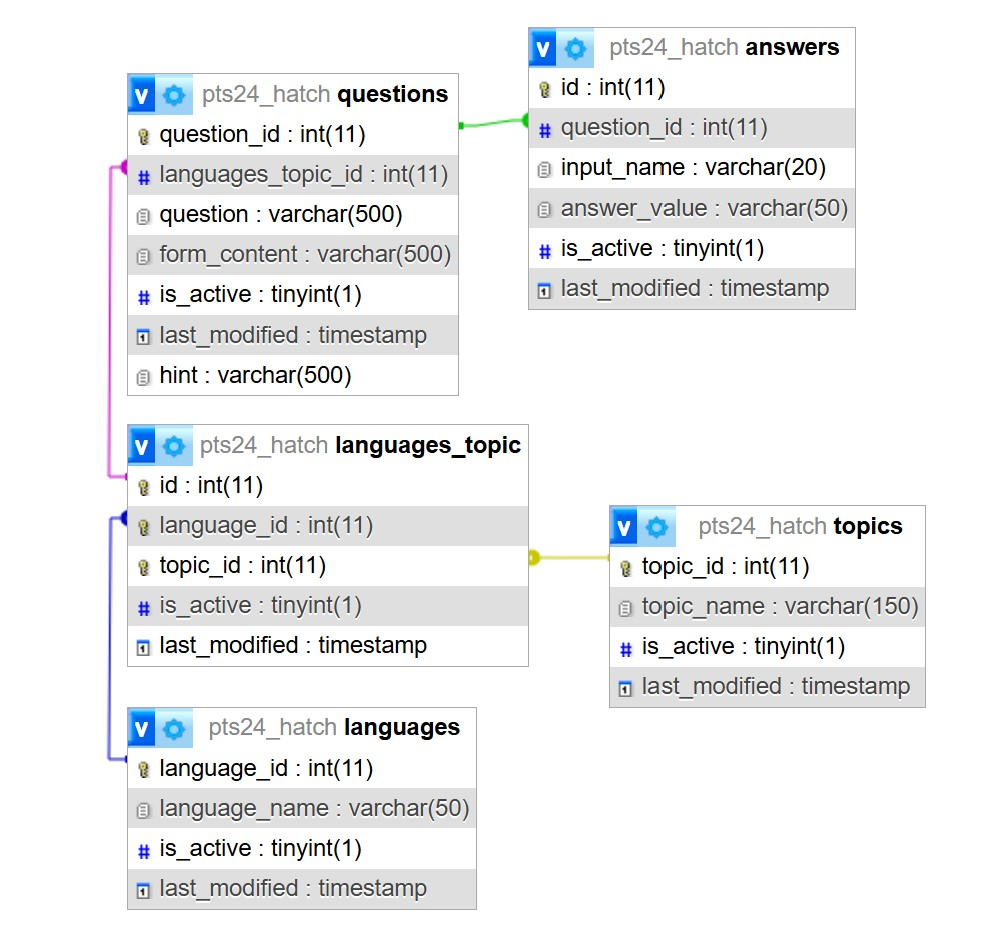

---

## System Architecture

The application follows a classic full-stack architecture:

User → Frontend (HTML/CSS/JS) → PHP Backend → MySQL Database

The admin panel interacts with the same database to manage learning content dynamically.

---

## Running the Project Locally

This project requires a local PHP environment and a MySQL database.

Example setup:

* Install XAMPP or another PHP environment
* Import the provided `.sql` database file
* Configure database connection in the project files
* Run the project via `localhost`

The project is not publicly deployed and is available only on the school server.

---

## Screenshots

### Index page
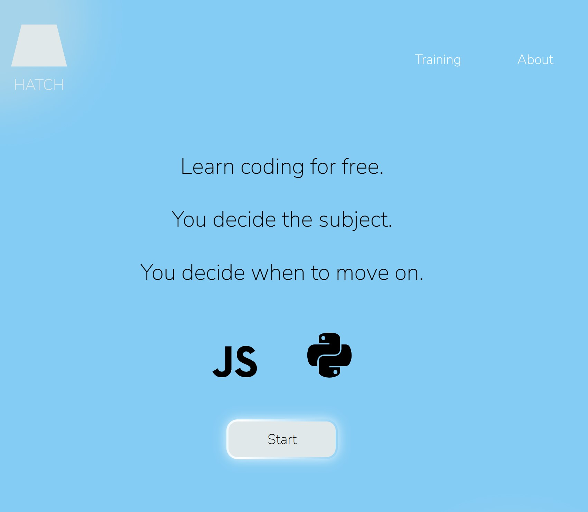

### Select programming language page
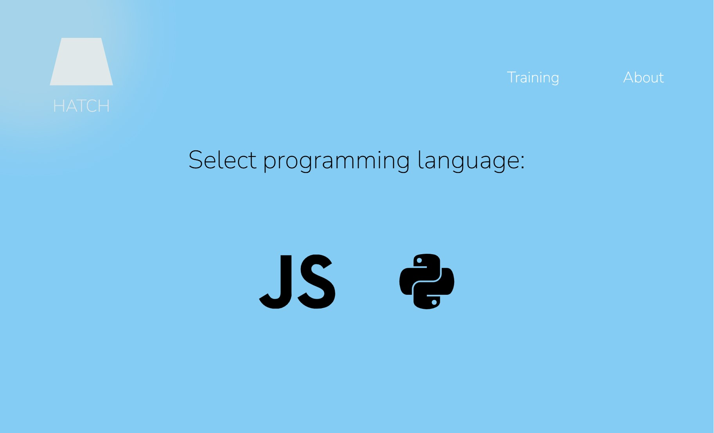

### Select topic page
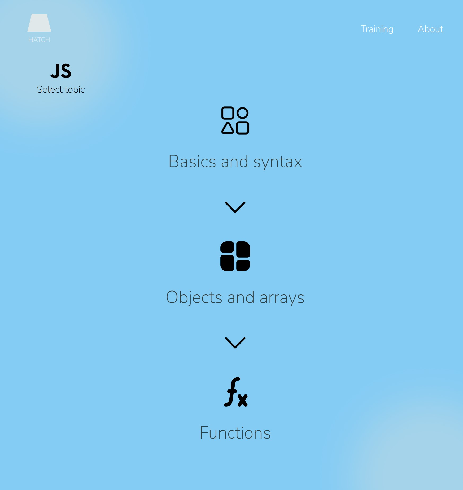

### Quiz page
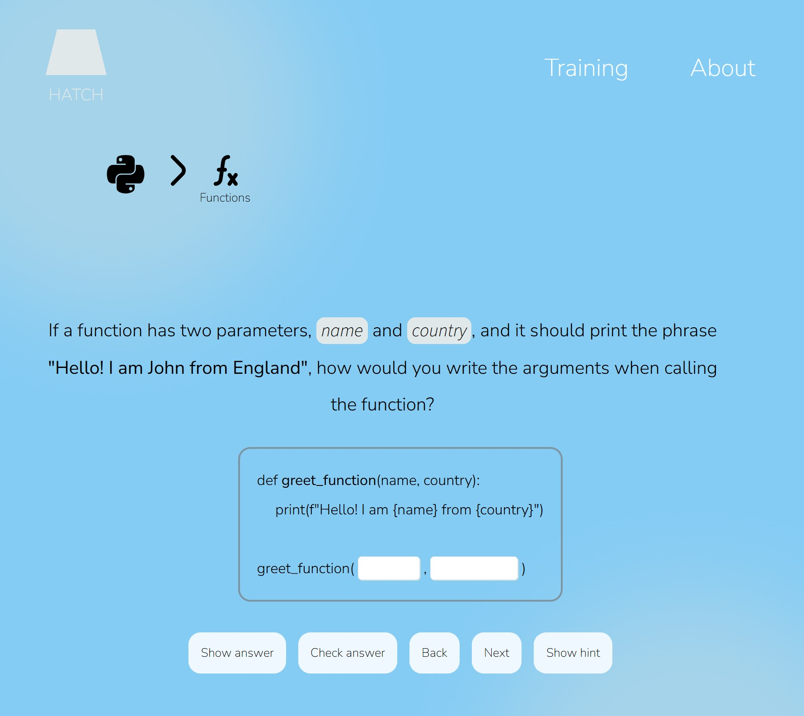

### Quiz page: show answer
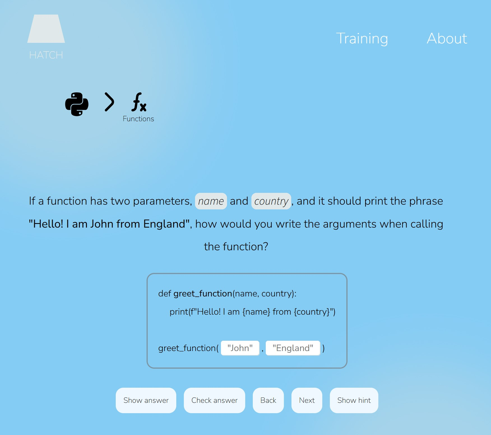

### Quiz page: check answer
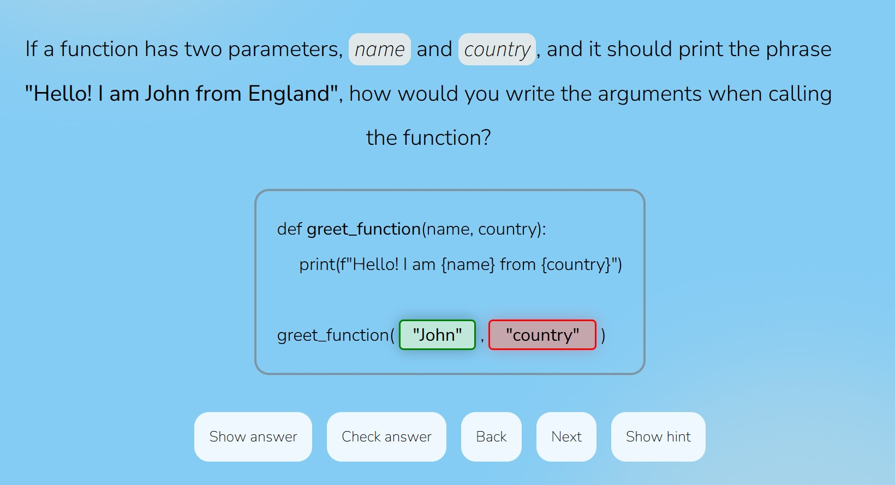

### Quiz page: no questions
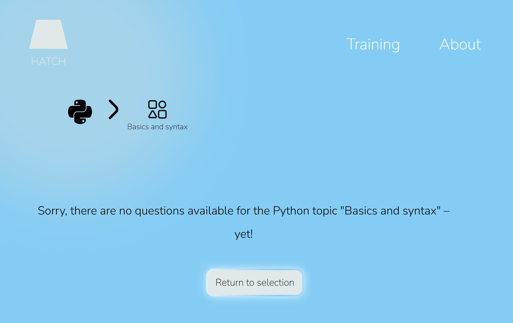

### Admin login page

### Admin page: select action
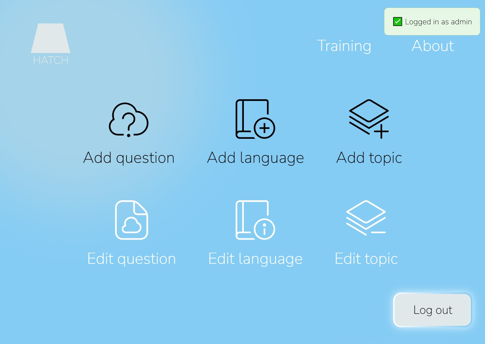

### Admin page: add a new programming language
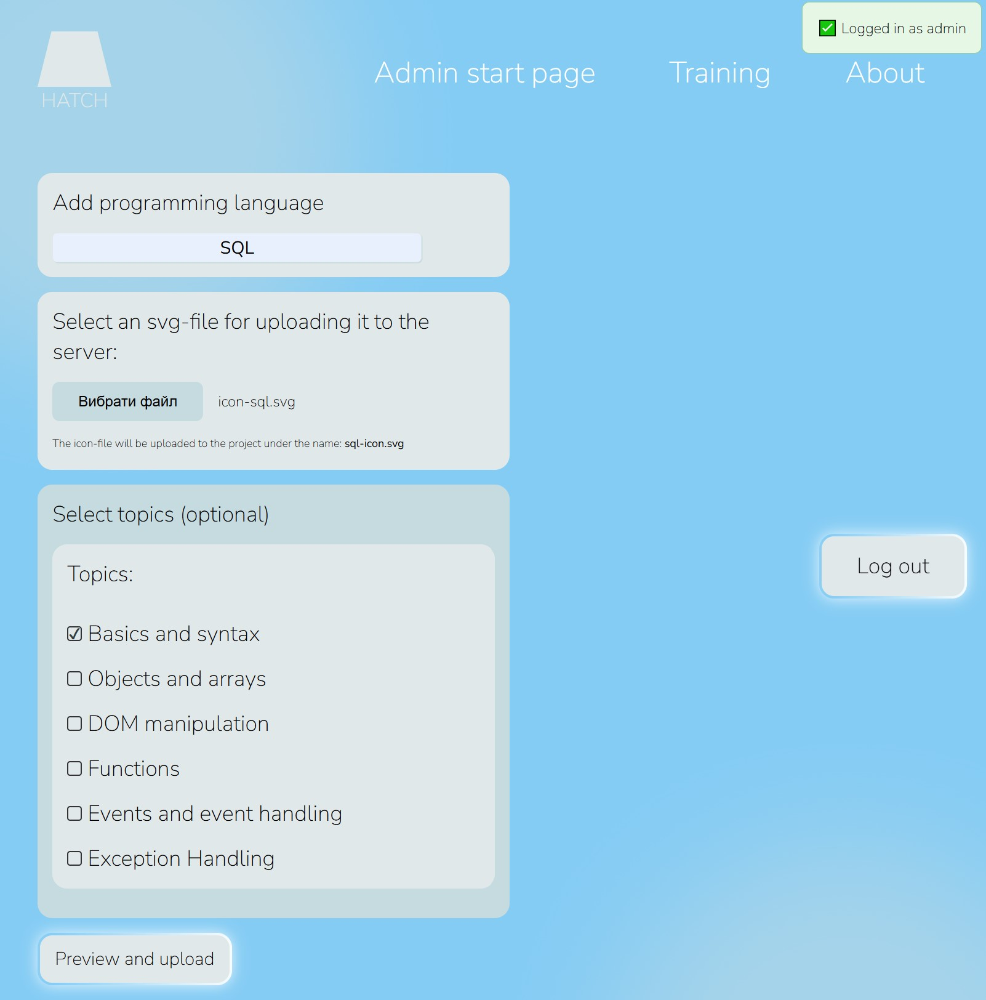

### Admin page: preview before storing the data in the DB

### Admin page: edit or delete record
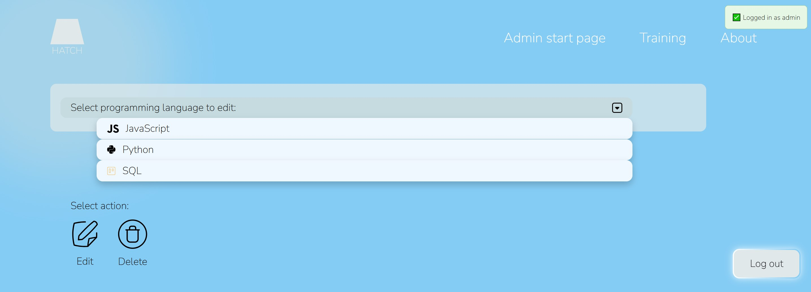

---

## Project Status

This project was developed for educational purposes as part of IT studies and is not actively maintained.

---

## Author & Ownership

This repository is presented as part of a learning portfolio.

The full ownership and intellectual property rights of the product belong to **Vertti Koivula**.
